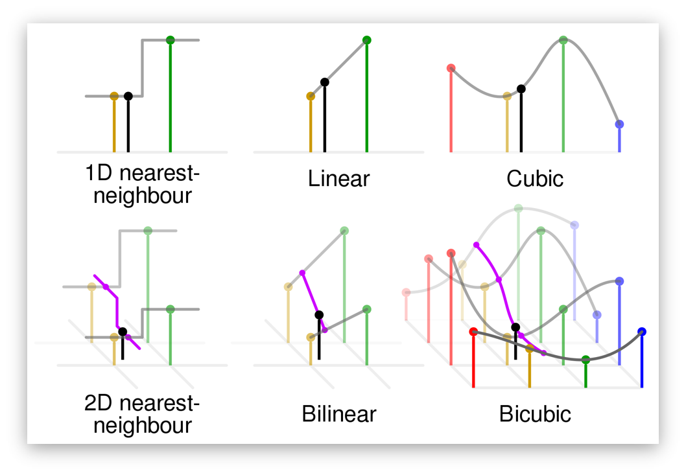

## histogram
> GrayScale 이미지의 PDF, CDF를 구해 반환하는 함수

### PDF
> Probability Distribution Function
 
PDF의 값을 구하기 위해서는 입력으로 받은 GrayScale 이미지의 0-255의 각 intensity가 이미지에 몇 픽셀이 있는지 구한다.
그 후 값을 이미지 크기로 나누어 총 합이 1이 되게 만들어 PDF 확률 값을 얻는다. 

### CDF
> Cumulative Distribution Function

CDF의 값은 PDF 의 값을 누적하여 계산한 것이다. CDF(255)는 1이 된다.

## resize
> 이미지의 크기를 크게 만들거나 작게 만들어 반환하는 함수

이미지의 크기를 변환할 때에는 변환될 이미지의 크기를 미리 잡고 변환될 이미지의 픽셀의 값을 for문으로 반복하여 모든 위치의 값을 계산한다. 이 때 실제 위치와 정확히 맞게 매칭될 수도 있지만 그렇지 않을 경우 보간법을 통해 값을 얻어온다.

### Interpolation
> 보간법
> 이미지의 픽셀의 값이 아닌 픽셀 사이의 값을 참조하려 할 때에 어떤 값을 사용할지를 정하는 방법

이미지의 값을 가져올 때에 연산을 하다보면 정수의 연산으로만 떨어지는 것이 아닌 실수 위치의 값을 참조해야할 때가 생기게 된다. 하지만 실제 이미지의 값은 정수 위치의 값만을 가지고 있으므로 실수 위치의 값을 가지고 오기 위하여 보간법을 사용해야 한다.

#### Nearest
> 가장 가까운 값을 사용하는 방법

단순히 가장 가까운 값을 가져오는 방법으로 index가 실수 값으로 계산되었을 때 round(반올림) 함수를 이용하여 가장 가까운 index로 이동시키게 된다. 이 때에 가장자리 부분에 대하여 원래 이미지에서 벗어나는 값을 참조하려 할 경우를 막기 위해 padding을 사용하거나 무시시켜버리기도 한다. 단, 무시할 경우 가장자리 부분이 0으로 채워질 수 있다.

#### Bilinear
> 가까운 네 점의 값을 계산하여 값을 가져오는 방법

실수 index를 floor(내림)연산을 취하고 이 값과 이 값에 +1을 x, y축에 대해 각각 취한 값으로 네 점을 구할 수 있게 된다. 이 네 점의 intensity는 실제 이미지에서 있었을 것이므로 이 값들이 선형적으로 변화한다고 가정하여 linear 연산으로 실수 위치의 intensity를 구하는 방법이다.

### Padding
> 기존 이미지에서 벗어나는 가장자리 값을 참조할 때에 그 값을 대신해주기 위한 값을 씌우는 것

실제 이미지에서 filter 혹은 resize, rotate등의 작업을 할 때에 실제 이미지의 값을 벗어나는 값을 구하려고 한다면 값을 참조할 수가 없다. 이 문제를 막기 위해 실제 값의 가장자리 부분을 padding값으로 채워 문제를 발생하지 않게 만든다.
이 때 zero padding, repetition padding, mirror padding의 방법이 사용된다.

#### Zero padding
> 단순히 0으로 채움

matlab의 zeros 를 통해 공간을 만든 후 이미지를 중앙에 두어 기존에 설정해둔 zeros의 값이 padding이 되게 만드는 방법이다. 위에서 있었던 벗어나는 값을 참조하는 경우는 일어나지 않지만 가장자리 부분이 검은색으로 보이게 될 수 있다.

#### Repetition padding
> 가장자리 부분의 값을 반복하는 padding

가장자리 부분의 값을 단순 반복시키는 방법이다. zero padding에 있었던 가장자리 부분이 검은색으로 보이는 현상이 사라진다.

#### Mirror padding
> 이미지 경계에서부터 거울처럼 반사된 것처럼 보이는 padding

가장자리부터 padding size만큼 기존 이미지와 대응되게 값을 복사하는 방법이다. 

